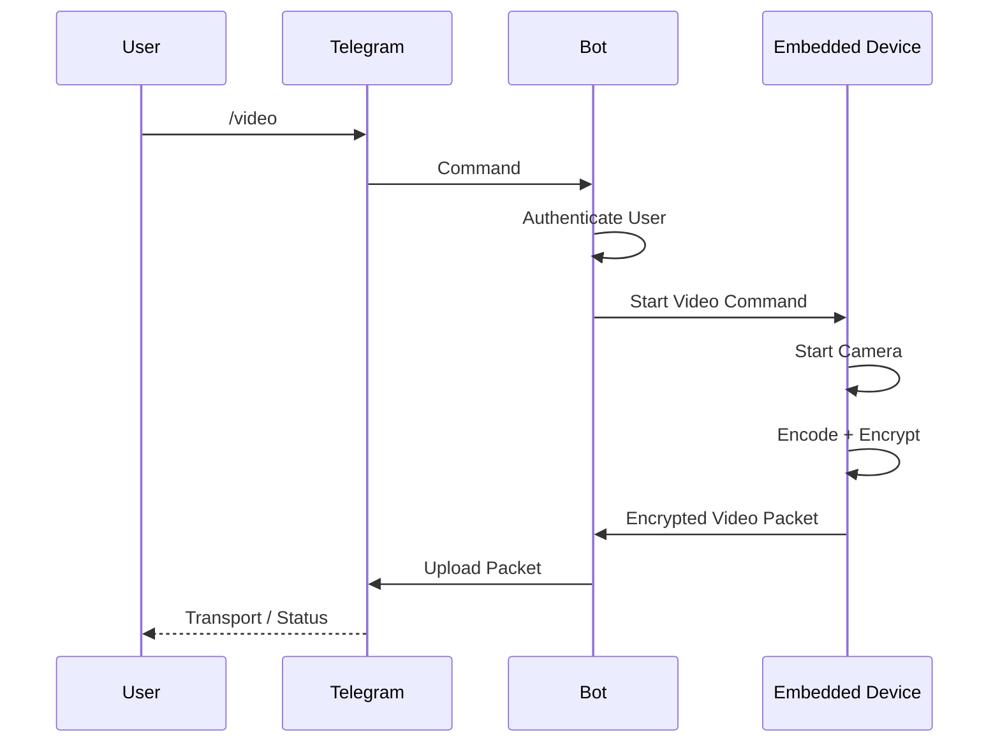
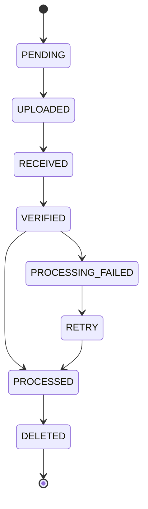
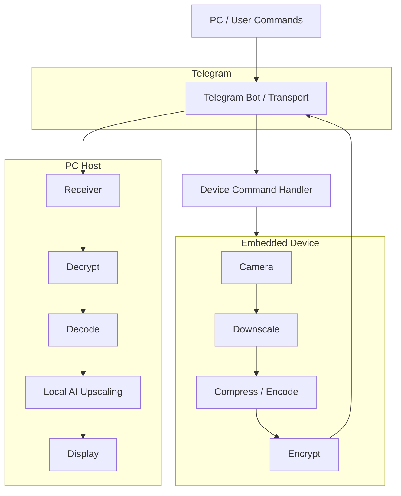
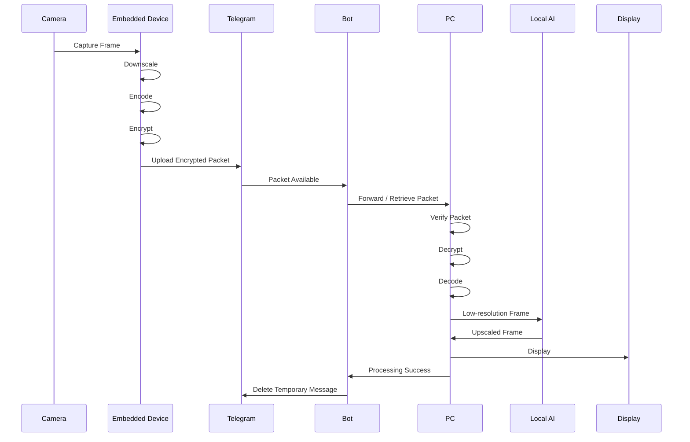
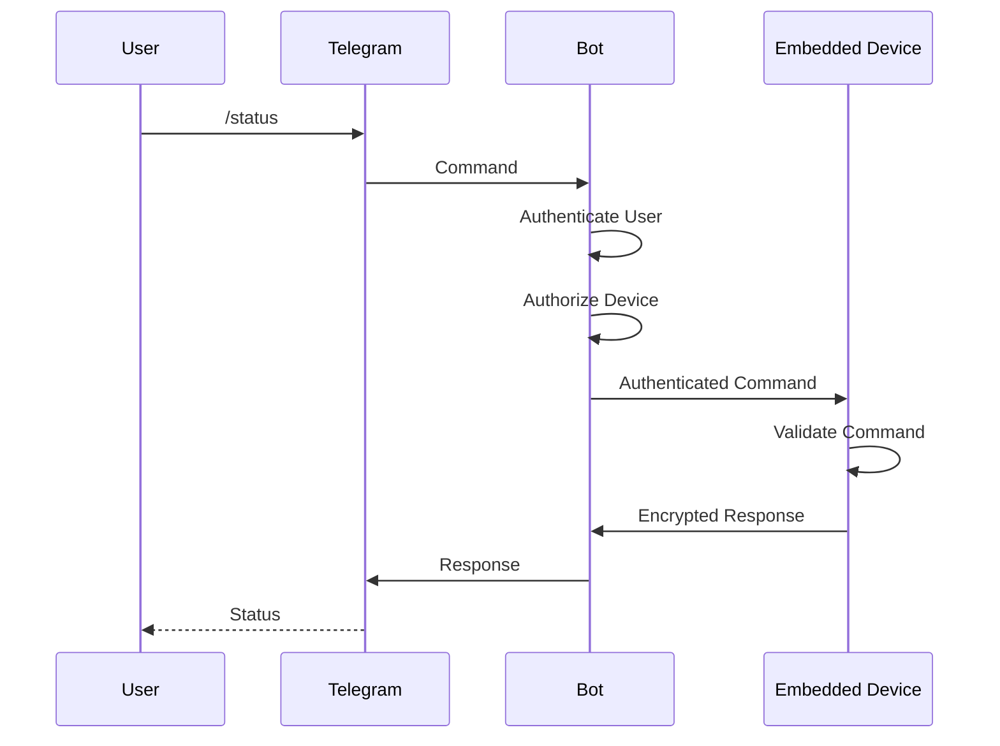
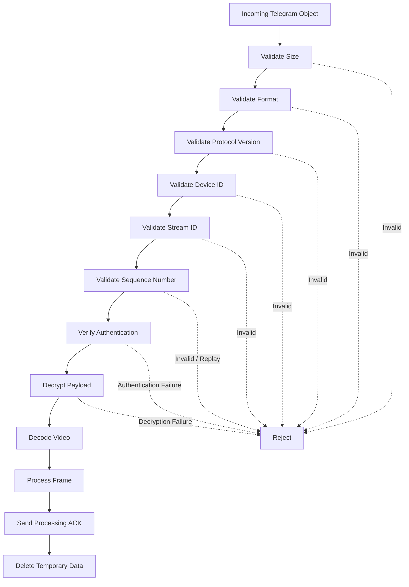
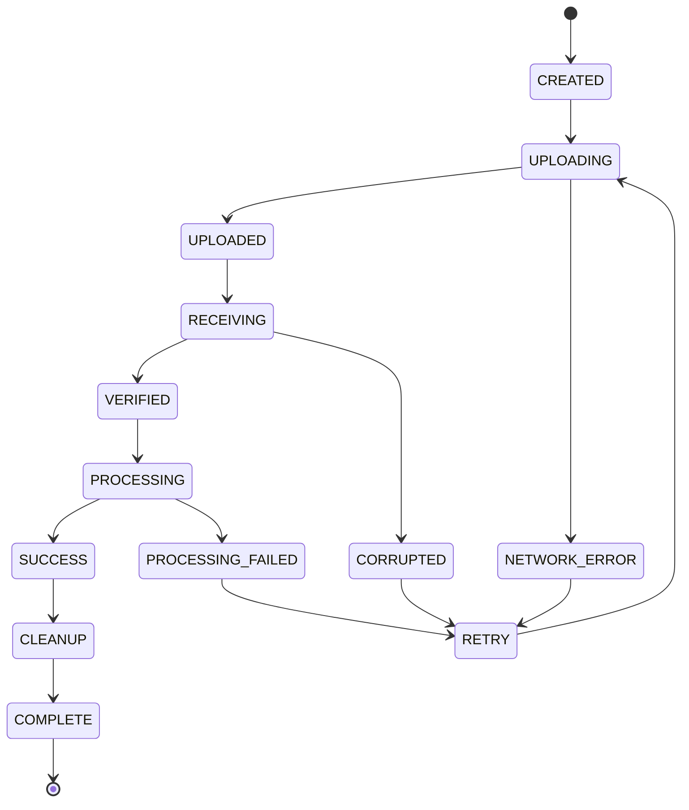
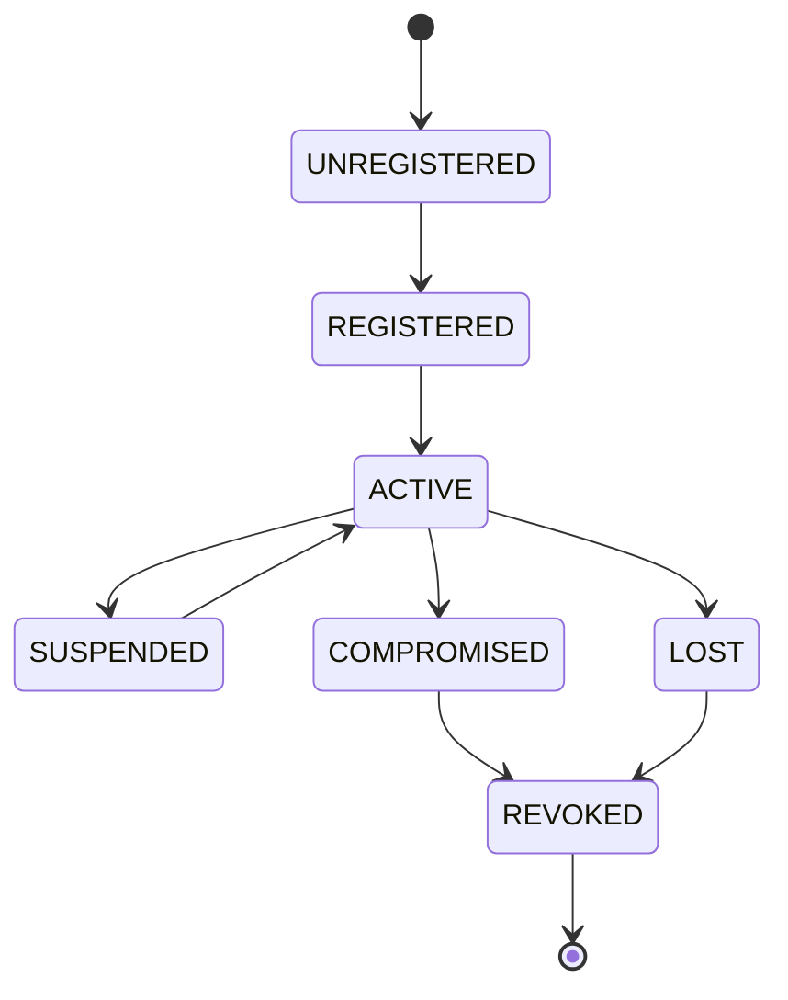
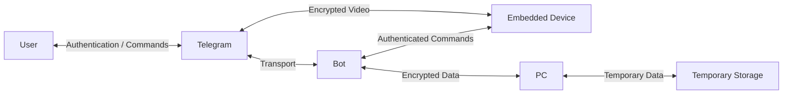
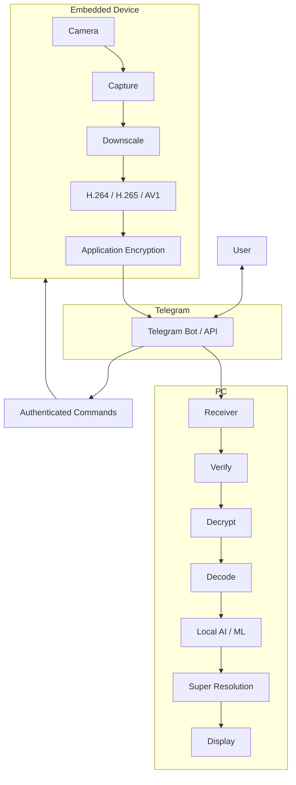

# Telegram-video-streamer

 A privacy-focused video and command communication system using **Telegram as the communication/control interface**, with **local AI/ML processing on the PC and embedded device**.

 The main goal is to minimize bandwidth while maintaining usable video quality.

 ## Architecture

 Mermaid flowchart: Camera, Frame Capture, Local Downscaler, H.264 / H.265 / AV1 Encoder, Application Encryption, Telegram Bot / API, Application Decryption, Local Decoder, Local AI Super Resolution, Local Upscaling, Display

### Communication flow

 Mermaid flowchart: User, Telegram, Telegram Bot, Embedded Device

The architecture separates:

 - **Telegram** — communication, control and transport
- **Embedded device** — camera capture, downscaling, compression and encryption
- **PC** — decryption, decoding, AI processing and display
- **Local storage** — short-lived temporary processing data

---

 # 1\. Objectives

 The system is designed to:

 - Use Telegram as the primary command and communication interface.
- Reduce video bandwidth by downscaling and compressing video on the embedded device.
- Perform AI/ML super-resolution locally on the PC.
- Avoid uploading unnecessary original-resolution video.
- Automatically delete temporary Telegram messages/files after successful processing.
- Keep only required operational information in the Telegram chat.
- Encrypt sensitive video and command data before transmission.
- Keep AI inference local rather than sending video to cloud AI services.
- Support both PC and embedded Linux-class devices.
- Recover cleanly from network interruptions.
- Prevent stale video fragments from accumulating.

---

 # 2\. Security Model

 Telegram should **not** be treated as the application's only encryption boundary.

 Sensitive payloads should be encrypted by the application before being uploaded.

 Mermaid flowchart: Camera, Frame, Downscale, Compress, Application Encryption, Telegram Transport, Application Decryption, Decode, AI Upscaling, Display

Recommended cryptographic design:

 - X25519 for key agreement.
- Ed25519 for device identity and signatures.
- AES-256-GCM or ChaCha20-Poly1305 for authenticated encryption.
- Unique nonce/IV for every encrypted object.
- Device-specific key pairs.
- Separate encryption keys from authentication/signing keys.
- Never hard-code private keys in source code.
- Store secrets in an OS/embedded secure storage mechanism where available.
- Rotate/revoke device keys when a device is lost or compromised.
- Do not implement cryptography yourself.
- Use a well-tested cryptographic library.

---

 # 3\. Important Telegram Limitation

 A normal Telegram bot conversation should **not** be considered equivalent to end-to-end encrypted private communication.

 Therefore, this project uses **application-layer encryption** for sensitive video and private payloads.

 Telegram receives encrypted blobs rather than usable original video data.

 The bot should also avoid logging:

 - Original video frames.
- Decrypted video.
- Encryption keys.
- Private command contents where unnecessary.
- Personal information.
- Temporary file contents.

---

 # 4\. Project Structure

```
telegram-local-video/
│
├── README.md
├── LICENSE
├── requirements.txt
├── .env.example
│
├── common/
│   ├── crypto.py
│   ├── protocol.py
│   ├── messages.py
│   └── logging.py
│
├── bot/
│   ├── main.py
│   ├── commands.py
│   ├── queue.py
│   └── cleanup.py
│
├── embedded/
│   ├── main.py
│   ├── camera.py
│   ├── encoder.py
│   ├── downscale.py
│   ├── uploader.py
│   └── device_commands.py
│
├── pc/
│   ├── main.py
│   ├── receiver.py
│   ├── decoder.py
│   ├── upscaler.py
│   ├── renderer.py
│   └── pc_commands.py
│
├── models/
│   └── README.md
│
├── tests/
│   ├── test_crypto.py
│   ├── test_protocol.py
│   └── test_cleanup.py
│
└── data/
    ├── incoming/
    ├── processing/
    └── temporary/
```

---

 # 5\. Communication Protocol

 Each video packet should contain only the information required to reconstruct the stream.

 Example:

```jason
{
  "version": 1,
  "device_id": "device-001",
  "stream_id": "stream-abc",
  "sequence": 1528,
  "timestamp": 1780141234,
  "codec": "h265",
  "width": 640,
  "height": 360,
  "fps": 15,
  "encrypted": true,
  "payload": "<encrypted-data>"
}
```

 Sensitive metadata should also be encrypted where practical.

 Never place secrets inside the Telegram message itself.

 Every packet should be authenticated and protected against modification.

---

 # 6\. Video Pipeline

 ## Embedded Device

 The embedded device performs:

 Mermaid flowchart: Camera, Capture, Resolution Reduction, Optional Noise Reduction, Video Encoding, Application Encryption, Telegram Upload

Example:

```
1920 × 1080
     ↓
640 × 360
     ↓
H.265
     ↓
Encrypted packet
     ↓
Telegram
```

 The exact resolution, bitrate and FPS should be configurable.

 Example configuration:

```
video:
  source_width: 1920
  source_height: 1080

  output_width: 640
  output_height: 360

  fps: 15
  codec: h265
  bitrate: 500k

  adaptive_bitrate: true
```

---

 # 7\. PC AI Upscaling

 The PC receives the compressed low-resolution stream and performs local AI super-resolution.

 Mermaid flowchart: Telegram, Encrypted Packet, Decrypt, Decode, AI Super Resolution, 1920 × 1080, Display

Possible local inference backends include:

 - ONNX Runtime
- TensorRT
- OpenVINO
- PyTorch
- DirectML
- CUDA

 The implementation should select the available accelerator automatically.

 Example:

```python
class LocalUpscaler:
    def __init__(self, model):
        self.model = model

    def upscale(self, frame):
        return self.model(frame)
```

 No frame should be sent to a remote AI service.

---

 # 8\. Telegram Bot Responsibilities

 The Telegram bot acts primarily as the communication and control layer.

 Example commands:

```
/start
/status
/video
/stop
/snapshot
/restart
/device
/devices
/quality
/bitrate
/fps
/logs
```

 Example command flow:



 The bot should authenticate and authorize every command.

 Example:

```python
AUTHORIZED_USERS = {
    123456789,
    987654321,
}

def authorized(user_id):
    return user_id in AUTHORIZED_USERS
```

 For production, use a proper authorization mechanism rather than relying only on a hard-coded list.

---

 # 9\. Upload → Process → Delete

 Temporary Telegram data should follow this lifecycle:

 Mermaid flowchart: Create, Upload, Acknowledge, Download, Verify, Decrypt, Process, Success, Delete Telegram Message, Delete Local Temporary Data

Deletion must happen **only after successful processing**.

 Never delete the only copy before confirming successful reception.

 ## State machine



 If processing fails:

```
PROCESSING_FAILED
       ↓
RETRY
       ↓
SUCCESS
       ↓
DELETE
```

---

 # 10\. Data Retention

 The system should use short-lived temporary storage.

 Recommended policy:

```
Raw embedded frame:
    Never stored unless explicitly required.

Encoded packet:
    Temporary.

Telegram encrypted message:
    Delete after confirmed processing.

PC encrypted file:
    Delete after successful decryption.

Decoded frame:
    Memory only where possible.

AI output:
    Memory/display only unless recording is explicitly requested.

Logs:
    No video or private payloads.
```

 A cleanup worker should periodically remove abandoned temporary files.

 Example:

```python
def cleanup(directory, max_age_seconds):
    """
    Delete temporary files older than the configured
    retention period.
    """
    ...
```

---

 # 11\. Reliability

 The system should tolerate:

 - Telegram API interruptions.
- Wi-Fi interruptions.
- Internet outages.
- Missing packets.
- Duplicate packets.
- Corrupted packets.
- Device restarts.
- PC restarts.

 Every packet should have:

```
device_id
stream_id
sequence_number
timestamp
protocol_version
authentication_tag
```

 Duplicate packets should be detected using the sequence number.

 The receiver should maintain enough state to safely resume or discard stale packets after interruption.

---

 # 12\. Bandwidth Optimization

 The embedded device should dynamically adjust:

 - Resolution
- FPS
- Bitrate
- Keyframe interval
- Compression level

 Example adaptive pipeline:

 Mermaid flowchart: Measure Network Conditions, Connection Quality, 640×360 @ 20 FPS, 480×270 @ 15 FPS, 320×180 @ 10 FPS, Transmit, PC Receiver, AI Super Resolution, Display

The PC can then use AI super-resolution to reconstruct a higher-resolution display.

 AI upscaling improves perceived image quality, but it cannot recreate information that was completely lost during downscaling or compression.

---

 # 13\. Privacy Requirements

 Never send the following unnecessarily:

 - Original-resolution video.
- Unencrypted frames.
- Private keys.
- Encryption keys.
- Passwords.
- Device credentials.
- Unnecessary GPS information.
- Unnecessary personal metadata.
- Debug dumps containing private data.

 Logging should look like:

```
INFO  stream started
INFO  device=device-001 sequence=1528
INFO  packet verified
INFO  packet processed
INFO  temporary data deleted
```

 Not:

```
DEBUG frame_data=...
DEBUG encryption_key=...
DEBUG user_password=...
```

---

 # 14\. Configuration

 Use environment variables or a secure configuration system.

 Example `.env.example`:

```
TELEGRAM_BOT_TOKEN=
DEVICE_ID=
DEVICE_PRIVATE_KEY=
SERVER_PUBLIC_KEY=
LOG_LEVEL=INFO
```

 Never commit:

```
.env
*.key
*.pem
data/incoming/*
data/processing/*
data/temporary/*
```

 A production deployment should additionally consider:

 - File permissions.
- Secret rotation.
- Hardware-backed key storage.
- Device enrollment.
- Device revocation.
- Secure configuration backups.

---

 # 15\. Recommended Technology Stack

 ## Embedded

 - Python / C++
- OpenCV
- FFmpeg or GStreamer
- Hardware H.264/H.265 encoder
- Telegram Bot API
- libsodium / cryptography

 ## PC

 - Python / C++
- FFmpeg
- OpenCV
- ONNX Runtime
- TensorRT / CUDA / DirectML / OpenVINO
- Telegram Bot API
- libsodium / cryptography

 ## Bot

 - Python
- `python-telegram-bot`
- AsyncIO
- SQLite/PostgreSQL for minimal non-sensitive state

---

 # 16\. Security Rules

 The implementation MUST:

 - Authenticate devices.
- Authenticate Telegram users.
- Encrypt sensitive application payloads.
- Authenticate encrypted packets.
- Never reuse encryption nonces.
- Never store encryption keys in source code.
- Delete temporary data after successful processing.
- Avoid logging private information.
- Validate uploaded file sizes and types.
- Reject malformed packets.
- Rate-limit commands.
- Prevent unauthorized device control.
- Use least-privilege filesystem permissions.
- Keep AI processing local.
- Provide a mechanism to revoke compromised devices.
- Protect against replay attacks.
- Validate protocol versions.
- Validate sequence numbers.
- Reject unexpected device identifiers.
- Fail closed when authentication fails.

---

 # 17\. End-to-End Flow



---

 # 18\. Important Design Principle

 Telegram should be treated as the **transport and user-interface layer**, not as the location where the application's sensitive video data is trusted.

 The architecture should therefore be:

 Mermaid flowchart: Local Camera, Local Compression, Local Encryption, Telegram Transport, Local Decryption, Local AI / ML, Local Display

This minimizes transferred data and keeps the computationally expensive AI processing on the PC.

---

 # 19\. Detailed Data Flow

 The complete system can be represented as:



---

 # 20\. Command Architecture

 Commands should follow the same authenticated communication path.



 For sensitive commands, the command payload itself should be protected using the application's cryptographic protocol rather than relying only on Telegram transport security.

---

 # 21\. Packet Processing

 A recommended packet-processing pipeline is:



---

 # 22\. Error Recovery

 Network or processing failures should not cause the system to permanently lose state.



 The retry mechanism should use bounded retries and backoff rather than continuously retrying failed operations.

---

 # 23\. Device Lifecycle

 Each embedded device should have an identity and revocation state.



 A revoked device must no longer be able to send valid application-layer packets or execute privileged commands.

---

 # 24\. AI Processing Architecture

 The AI pipeline should remain completely local to the PC.

 Mermaid flowchart: Decoded Low-Resolution Frame, AI Preprocessing, Available Accelerator, CPU, CUDA / GPU, TensorRT, DirectML, OpenVINO, Super Resolution Model, Postprocessing, Upscaled Frame, Display

No remote AI API should be required for the normal video-processing pipeline.

---

 # 25\. Cleanup Architecture

 Temporary data should have a dedicated lifecycle.

 Mermaid flowchart: Temporary Data Created, Currently Processing, Processing Successful, Processing Failed, Retention Timeout, Secure Cleanup, Retry

Cleanup must never remove an actively processing object.

 The system should maintain enough state to distinguish:

 - Active data.
- Successfully processed data.
- Failed data awaiting retry.
- Abandoned data.
- Data safe to delete.

---

 # 26\. Development Roadmap

 ## Phase 1 — Command Communication

 Implement:

 Mermaid flowchart: User, Telegram, Bot, Embedded Device

Requirements:

 - Telegram bot.
- User authentication.
- Device authentication.
- Basic command routing.
- Device status responses.
- Command authorization.

---

 ## Phase 2 — Basic Video

 Implement:

 Mermaid flowchart: Camera, Downscale, H.264 / H.265, Telegram, PC, Decode, Display

Initially, focus on reliable transport and 3 — Encryption correct reconstruction before adding AI.

---

 ## Phase 3 — Encryption

 Add:

 - Key management.
- X25519 key agreement.
- Ed25519 device identity.
- Authenticated encryption.
- Packet verification.
- Replay protection.
- Device revocation.
- Key rotation.

---

 ## Phase 4 — Automatic Cleanup

 Implement:

 Mermaid flowchart: Upload, Receive, Verify, Process, Delete

Only successfully processed objects should be deleted automatically.

---

 ## Phase 5 — Local AI

 Add:

 Mermaid flowchart: Decoder, ONNX / TensorRT / Other Backend, Super Resolution, Display

The PC should automatically select an available local acceleration backend.

---

 ## Phase 6 — Adaptive Streaming

 Add automatic adjustment of:

 - FPS.
- Resolution.
- Bitrate.
- Compression.
- Keyframe interval.

 Based on measured network conditions.

 Mermaid flowchart: Network Monitor, Network Quality, High Quality, Medium Quality, Low Quality, Video Encoder, Telegram Transport

---

 # 27\. Production Requirement

 Before deploying this system with real private video, perform a **security review and penetration test**.

 In particular, verify:

 - Telegram credentials cannot control arbitrary devices.
- Compromised Telegram accounts cannot automatically compromise device private keys.
- Deleted temporary data cannot be trivially recovered from persistent storage.
- Replay attacks are rejected.
- Modified packets are rejected.
- Unauthorized users cannot access video.
- A compromised PC cannot silently obtain device credentials.
- A lost embedded device can be revoked remotely.
- Invalid packets cannot crash the receiver.
- Malicious file sizes cannot exhaust storage.
- Commands are rate-limited.
- Authentication failures do not reveal sensitive information.
- Logs do not contain secrets or private video data.

---

 # 28. Security Boundaries

 The system has several distinct trust boundaries:



 The important principle is that Telegram is **not trusted with plaintext application payloads**.

---

 # 29\. Threat Model

 The design should account for at least the following threats:

 | Threat | Protection |
| --- | --- |
| Unauthorized Telegram user | User authentication and authorization |
| Compromised Telegram account | Application-layer encryption and device authorization |
| Packet modification | AEAD authentication |
| Packet replay | Sequence numbers, timestamps and replay state |
| Lost device | Device revocation |
| Compromised device | Key rotation/revocation |
| Malicious uploaded file | Size/type validation |
| Storage exhaustion | Quotas and cleanup |
| Network interruption | Retry and state recovery |
| Duplicate packets | Sequence tracking |
| Corrupted packets | Authentication and integrity checks |
| Key leakage | Secure secret storage |
| Debug-data leakage | Privacy-aware logging |
| Remote AI data exposure | Local-only inference |

---

 # 30\. Bandwidth Model

 The system intentionally trades some source information for reduced bandwidth.

 For example:

 Mermaid flowchart: 1920×1080 Source, 640×360, H.265 @ 500 kbps, Encrypted Payload, Telegram, PC, AI Super Resolution, 1920×1080 Display

The output may visually appear significantly better than the original 640×360 stream, but AI super-resolution does not restore information that was completely discarded during capture, downscaling or compression.

---

 # 31\. Example Runtime Configuration

 A possible configuration structure:

```
system:
  device_id: device-001
  log_level: INFO

telegram:
  enabled: true
  cleanup_after_processing: true

video:
  source_width: 1920
  source_height: 1080

  output_width: 640
  output_height: 360

  fps: 15
  codec: h265
  bitrate: 500k

  adaptive_bitrate: true
  adaptive_resolution: true
  adaptive_fps: true

security:
  encryption: true
  replay_protection: true
  key_rotation_days: 30

storage:
  incoming: data/incoming
  processing: data/processing
  temporary: data/temporary

  max_age_seconds: 300

ai:
  enabled: true
  model: super_resolution.onnx
  backend: auto
```

---

 # 32\. Example Logging Policy

 Allowed:

```
INFO  device registered
INFO  stream started
INFO  packet received
INFO  packet verified
INFO  packet processed
INFO  temporary object deleted
WARN  network interruption
WARN  packet retry
ERROR packet authentication failed
```

 Not allowed:

```
DEBUG encryption_key=...
DEBUG private_key=...
DEBUG frame_data=...
DEBUG decrypted_video=...
DEBUG telegram_token=...
DEBUG password=...
```

---

 # 33\. Core Design Principles

 The implementation should follow these principles:

 1. **Local processing first**
   - Capture, downscale, encode and encrypt locally.
   - Decode, upscale and display locally.
2. **Telegram as transport**
   - Telegram provides communication and transport.
   - Telegram is not the application's trusted plaintext storage layer.
3. **Application-layer security**
   - Sensitive payloads are encrypted before Telegram receives them.
4. **Minimum data retention**
   - Temporary objects should exist only as long as necessary.
5. **Fail closed**
   - Authentication, integrity or authorization failures should stop processing.
6. **Recoverability**
   - Network and process interruptions should not corrupt stream state.
7. **Least privilege**
   - Every component should have only the permissions it requires.
8. **Local AI**
   - Video frames should not be sent to cloud AI services.
9. **Explicit device identity**
   - Every device must have a unique cryptographic identity.
10. **Revocation**
    - Compromised or lost devices must be removable from the trusted device set.

---

 # 34\. Final Architecture



---

 # Summary

 The intended architecture is:

 Mermaid flowchart: LOCAL CAMERA, LOCAL COMPRESSION, LOCAL ENCRYPTION, TELEGRAM TRANSPORT, LOCAL DECRYPTION, LOCAL AI / ML, LOCAL DISPLAY

**Telegram = interface + transport**

 **Embedded device = capture \+ downscale + compression \+ encryption**

 **PC = decryption + decoding \+ local AI upscaling \+ display**

 **Temporary Telegram/local data = processed, verified, then deleted**
