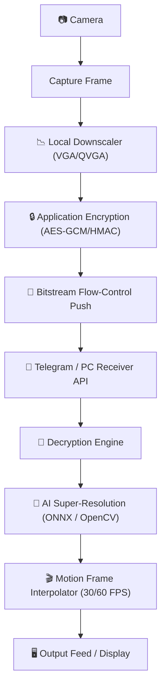
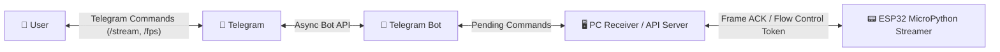
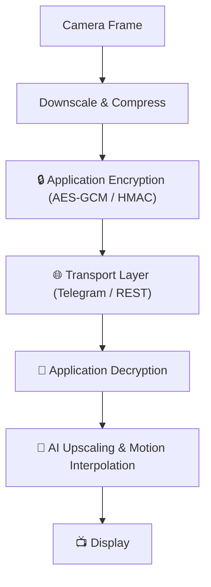
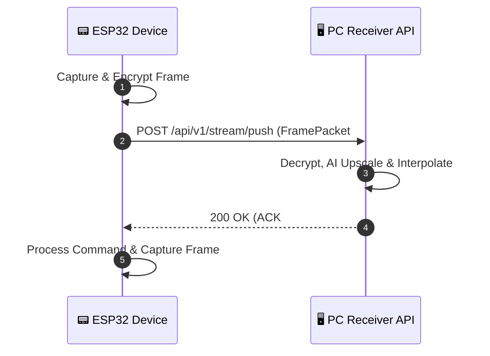

# Telegram-video-streamer

**Author & Contributor:** Antigravity (Google DeepMind Team)

A privacy-focused video and command communication system using **Telegram as the communication/control interface**, with **local AI/ML upscaling and high-performance motion frame interpolation on the PC**, paired with a low-power embedded Python device (ESP32).

---

## 1. System Architecture



### Communication & Flow Control



---

## 2. Quick Start & Deployment Guide

### A. PC / Server Setup & Usage

#### 1. Prerequisites
- Python 3.9+ installed on PC.
- (Optional) NVIDIA GPU with CUDA driver for ONNX GPU hardware acceleration.

#### 2. Installation
```bash
# Clone the repository
git clone https://github.com/samirunuwanaka/Telegram-video-streamer.git
cd Telegram-video-streamer

# Create a virtual environment
python -m venv venv
# Windows:
venv\Scripts\activate
# Linux/macOS:
source venv/bin/activate

# Install dependencies
pip install -r requirements.txt
```

#### 3. Configuration
Copy `.env.example` to `.env` and fill in your details:
```bash
cp .env.example .env
```
Edit `.env`:
```ini
TELEGRAM_BOT_TOKEN=123456789:YOUR_BOT_TOKEN
TELEGRAM_CHAT_ID=123456789
AUTHORIZED_USER_IDS=123456789

DEVICE_ID=esp32_cam_01
EMBEDDED_TARGET_FPS=10
AES_SECRET_KEY=0123456789abcdef0123456789abcdef0123456789abcdef0123456789abcdef

API_SERVER_HOST=0.0.0.0
API_SERVER_PORT=8000
USE_AI_UPSCALING=true
ENABLE_INTERPOLATION=true
INTERPOLATION_TARGET_FPS=30
```

#### 4. Running the PC API Server & Receiver
```bash
python -m pc.main
```
*The PC API Server will start on `http://0.0.0.0:8000`.*

#### 5. Running the Telegram Bot Interface (Optional)
In a separate terminal window:
```bash
python -m bot.main
```

#### 6. Accessing API Stream & Controls
- **Live Video Feed (MJPEG)**: `http://localhost:8000/api/v1/stream/feed`
- **Latest Frame (JPEG)**: `http://localhost:8000/api/v1/stream/frame`
- **Device Status**: `http://localhost:8000/api/v1/stream/status`
- **Set FPS**: `POST http://localhost:8000/api/v1/control/fps` with body `{"fps": 15}`
- **Stream Start/Stop**: `POST http://localhost:8000/api/v1/control/stream` with body `{"action": "start"}`

---

### B. ESP32 Embedded Setup & Usage

#### 1. Requirements
- ESP32-CAM (OV2640 camera module) or standard ESP32 board.
- MicroPython firmware flashed on the ESP32.

#### 2. Configuration (`embedded/config_esp32.py`)
Edit `embedded/config_esp32.py` with your Wi-Fi credentials and PC Server URL:
```python
WIFI_SSID = "YOUR_WIFI_SSID"
WIFI_PASS = "YOUR_WIFI_PASSWORD"
PC_SERVER_URL = "http://192.168.1.100:8000/api/v1/stream/push" # PC IP Address
SECRET_KEY_HEX = "0123456789abcdef0123456789abcdef0123456789abcdef0123456789abcdef"
```

#### 3. Uploading Code to ESP32
Upload the `common/` and `embedded/` folders to your ESP32 using `rshell`, `ampy`, or `Thonny IDE`:
```bash
# Example using ampy or thonny
ampy -p COM3 put common /common
ampy -p COM3 put embedded /embedded
```

#### 4. Execution on ESP32
Run `embedded/main.py`:
```python
import embedded.main
```
Or run directly on desktop for simulation/testing:
```bash
python -m embedded.main
```

---

## 3. Security Model

Sensitive payloads are encrypted by the application before being uploaded to Telegram or transported over HTTP:



### Cryptographic Standard
- **Encryption**: AES-256-GCM (PC) with MicroPython XOR-stream + SHA-256 HMAC fallback for ESP32 hardware.
- **Nonce/IV**: 12-byte cryptographically secure random nonce generated per frame.
- **Data Retention**: Immediate deletion of raw blobs upon verification (`Upload` $\rightarrow$ `Verify` $\rightarrow$ `Process` $\rightarrow$ `Delete`).

---

## 4. Communication Protocol

Each video frame packet follows this JSON protocol schema:

```json
{
  "version": 1,
  "device_id": "esp32_cam_01",
  "sequence": 1528,
  "timestamp": 1780141234.5,
  "codec": "jpeg",
  "width": 640,
  "height": 480,
  "fps": 10,
  "nonce": "Base64NonceString==",
  "payload": "Base64EncryptedBytes=="
}
```

---

## 5. Flow Control Mechanism (Stop-and-Wait)



---

## 6. Project Directory Structure

```
telegram-video-streamer/
│
├── config.py                 # Global system configuration
├── requirements.txt          # Python dependencies
├── .env.example              # Environment variables template
├── README.md                 # System documentation & guide
│
├── common/                   # Shared protocols & cryptography
│   ├── crypto.py             # AES-256-GCM & HMAC cipher engine
│   ├── protocol.py           # Frame & Command packet schema
│   └── messages.py           # Standardized status messages
│
├── embedded/                 # ESP32 MicroPython / Python code
│   ├── config_esp32.py       # Embedded configuration
│   ├── main.py               # ESP32 main streamer loop
│   ├── camera.py             # ESP32 OV2640 / webcam wrapper
│   ├── downscaler.py         # Low-computational compression
│   ├── crypto_esp32.py       # ESP32 cipher wrapper
│   ├── uploader.py           # Flow-control bitstream uploader
│   └── device_commands.py    # ESP32 state command handler
│
├── pc/                       # High-Performance PC Receiver & API
│   ├── config_pc.py          # PC engine configuration
│   ├── main.py               # PC application entry point
│   ├── api_server.py         # FastAPI REST & MJPEG endpoints
│   ├── receiver.py           # Stream receiver & buffer manager
│   ├── upscaler.py           # AI Super-Resolution upscaler
│   ├── interpolator.py       # Dense Optical Flow motion interpolator
│   ├── decoder.py            # Frame decoder
│   └── pc_commands.py        # PC server runner
│
├── bot/                      # Telegram Bot Interface
│   ├── main.py               # Telegram Bot runner
│   ├── commands.py           # Telegram slash commands (/stream, /fps)
│   ├── queue.py              # Frame queue manager
│   └── cleanup.py            # Temporary data garbage collector
│
└── tests/                    # Unit & Integration tests
    ├── test_crypto.py
    ├── test_protocol.py
    └── test_interpolation.py
```

---

## 7. License

MIT License.
